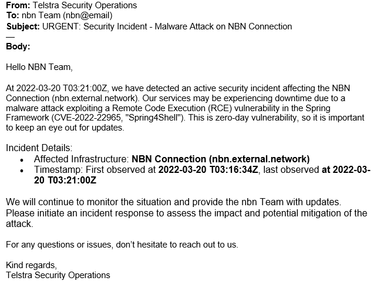

**Here is the background information on your task**

You are an information security analyst in the Security Operations Centre. A common task and responsibility of information security analysts in the SOC is to respond to triage incoming threats and respond appropriately, by notifying the correct team depending on the severity of the threat. It’s important to be able to communicate the severity of the incident to the right person so that the organization can come together in times of attack.

The firewall logs & list of infrastructure have been provided, which shows critical services that run the Spring Framework and need to be online / uninterrupted. A list of teams has also been provided, which, depending on the severity of the threat, must be contacted.

It’s important to note that the service is down, and functionality is impaired due to the malware attack.

**Here is your task**

Your task is to triage the current malware threat and figure out which infrastructure is affected.

First, find out which key infrastructure is currently under attack. Note the priority of the affected infrastructure to the company - this will determine who is the respective team to notify.

After, draft an email to the respective team alerting them of the current attack so that they can begin an incident response. Make sure to include the timestamp of when the incident occurred. Make it concise and contextual.

The purpose of this email is to ensure the respective team is aware of the ongoing incident and to be prepared for mitigation advice.

Armed with this information and our resources, I decided to figure out exactly how I was going to navigate this scenario. So, what are we actually looking for in this task?

Find the key infrastructure under attack. Keep in mind the priority.

When did the incident occur? Looking for a timestamp.

Send an email letting the relevant team of the incident using concise, yet key language.

The first thing that I wanted to do was take a look at the firewall logs- try to get an idea of what’s going on.

On our dashboard, I immediately see that our events summary graph shows anomalous activity starting a bit after 14:00. It was generally stable (flat) until that time period when it spikes to literally *hundreds* of events (compared to the \<50 or even \<25 events hours earlier). This is unusual and concerning. There is no question why our firewall alerted us to this.

If we move over to the actual Firewall Logs, we see a lot more information about these particular events. We see an “attacker” IP sending requests to the **nbn.external.network**. This presumably happens hundreds of times within. In the log we were provided for this task, they capped out at 500 events. I imagine in a real-world scenario, there could potentially be **many** more. For now, I don’t need to delve too heavily into these events. Just know that this suspicious IP is essentially flooding these requests to the network.

The first logged event occurred on **2022-03-20 T03:16:34Z**. The last logged event occurred on **2022-03-20 T03:21:00Z**.

On the next page we can see Telstra’s infrastructure list. We already saw that the attacker was targeting the network named **nbn.external.network**. It’s linked to the infrastructure named as **NBN Connection** and is managed by the **nbn Team**. This is responsible for providing a high-speed connection service and is marked as **P1- Critical** priority. We can understand why this may be marked as a critical priority. This network could essentially be the backbone of many of Telstra’s online services. If these were to experience downtime at all, it would be very detrimental to the company and its customers.

Additionally, we were provided with relevant information regarding a CISA Alert Advisory and CVE Advisory regarding the Spring4Shell vulnerability. It’s worth taking a look at these pages because they will give us information and context about what we are dealing with. In a real-world scenario, we might not be provided with this beforehand. We can briefly scan these pages and see that the exploit affects certain versions of **Spring Framework** and works through **RCE (Remote Code Execution)**. Well look at that! All of our infrastructure services are using **Spring Framework 5.3.0**. This tells me that there is a possibility we are being affected.

So, armed with this information, we can now go on to make our email. It’s important to keep in mind our audience. We wouldn’t necessarily use the same language to communicate with potential stakeholders as we would with the IT support team. If we know our audience isn’t well-versed in the language of our field, we shouldn’t lean heavily in that direction. Instead, we’d want to use concise, direct, and digestible language- one doesn’t need a lengthy technical background to understand. On the flip side, if we know our audience has a strong technical background- perhaps they are engineers or developers- then we have some leeway. However, it’s still important to be concise, but make sure that the information is present.

For this scenario, we are contacting the **nbn Team**, responsible for the **NBN Connection infrastructure**- the target of the attack. We may be able to expect their team to have a fair share of experienced network engineers and administrators. However, there isn’t too much information that we need to disclose in this email, so being overly technical or wordy isn’t warranted. They just need to know that an attack is happening. They need to know the who, what, when, where, and possibly how in concise terms.

This keeps the language concise, the important information is included, and a sense of urgency is expressed. Our email is brief, to-the-point, and contains the appropriate information for the relevant team(s) to start an incident response.
