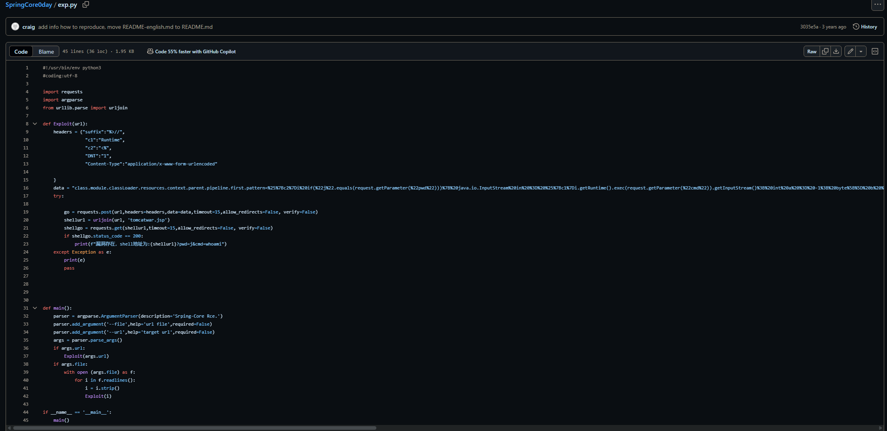
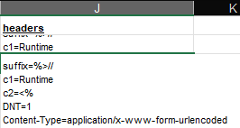
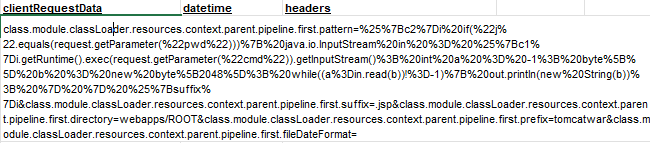
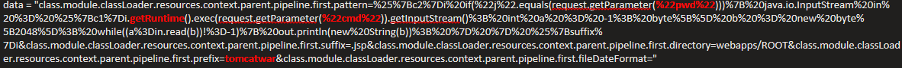
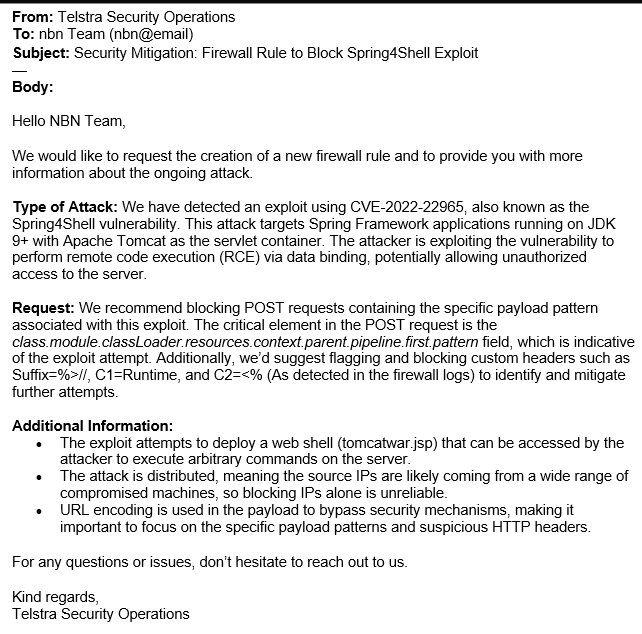

**Here is the background information on your task**

Now that you have notified the infrastructure owner of the current attack, analyze the firewall logs to find the pattern in the attacker’s network requests. You won’t be able to simply block IP addresses, because of the distributed nature of the attack, but maybe there is another characteristic of the request that is easy to block.

An important responsibility of an information security analyst is the ability to work across disciplines with multiple teams, both technical and non-technical.

In the resources section, we have attached a proof-of-concept payload that may be of interest in understanding how the attacker scripted this attack.

**Here is your task**

First, analyze the firewall logs in the resources section.

Next, identify what characteristics of the Spring4Shell vulnerability have been used.

Finally, draft an email to the networks team with your findings. Make sure to be concise, so that they can develop the firewall rule to mitigate the attack. You can assume the recipient is technical and has dealt with these types of requests before.

So, we’ve notified the team that there is a malicious actor using an exploit to harm our infrastructure. I am tasked with looking at the information that I’ve been provided in order to get enough relevant information about the attack and attacker(s).

**Analyze the Logs:**

After notifying the infrastructure owner of the ongoing attack, it's important to **analyze the firewall logs** to understand the nature of the attack. Here's the plan:

- **Identify patterns** in the attacker’s network requests. This step is critical for detecting the common characteristics of the attack.

- **Blocking IP addresses** is **unreliable** due to the **distributed nature of the attack**:

  - There are likely multiple **vectors** or **origins** for the attack, meaning it could be coming from many different IP addresses.

  - The distributed nature suggests the possibility of a **botnet** or **DDoS** attack, where many devices (often compromised) send traffic toward the target.

  - Since this is an **RCE** (Remote Code Execution) attack, these IP addresses could be from **numerous machines** around the world. The **prompt doesn’t provide details about the IPs**, but it's possible these requests are coming from **unique** and **different sources**, potentially even from different domains.

- **Focus on mitigating the attack at its core**, not just blocking IPs:

  - By analyzing how the attack operates and **what it is specifically targeting**, we can potentially find a **longer-term solution**. Rather than just trying to block IPs, we aim to understand the **attack’s specific vector**.

  - If we identify **vulnerable aspects** of the system (e.g., specific endpoints or services being targeted), we can implement a more robust defense that prevents the attacker from achieving their goal, making the solution more effective and sustainable than blocking IPs.

We were given some information regarding aspects of the CVE-2022-22965: Spring Framework RCE via Data Binding on JDK 9+. It has some prerequisites which give us an idea of what to look out for:

• JDK 9 or higher

• Apache Tomcat as the Servlet container

• Packaged as WAR

• spring-webmvc or spring-webflux dependency

We were also given the **Spring4Shell Proof of Concept Payload**, the Affected Infrastructure List & Firewall Logs, and official vulnerability pages with information about the exploit. Armed with these tools, I could begin to learn more.

• **Apache Tomcat as the Servlet container & Packaged as WAR**

- These were noted in the CVE as prerequisites for the exploit

- They are also both present in the log as \tomcatwar.jsp

• **Suspicious headers**

- I learned a bit about code in the context of website or http headers in one of UMGC courses and this was mentioned.

- Most websites use common headers to provide information about something

  - There are also uncommon headers that malicious actors may use to fool the system into running their malicious code. Some examples include these which were taken from the log.

    - Suffix=%\>//

    - C1=Runtime

    - C2=\<%

> 

We can see the malicious code string and get an idea of what the attacker is trying to do. I'm not well-versed in dissecting it yet, but a bit of research taught me a lot.

- The overwhelming amount of **%** signs is the attacker trying to mask their code and their intentions

  - This is **URL encoding**, so that our security systems won't detect/block unauthorized commands.

  - Normally certain strings will not be allowed to exist and thus be blocked. The nature of URL encoding can sometimes bypass this.

- The existence of "**pwd**" and "**cmd**" in this string is reason enough to be suspicious given the recent attack.

  - The attacker can execute their remote code by entering their decided password. It could also be a smokescreen to make it appear as if the code is somewhat legitimate: "**j**"

  - With "**cmd**" and "**Runtime**", it brings up more concerns such as the actual execution and scope of the malicious code.

We can assume that the other prerequisites are met based on assumption of the scenario provided:

- spring-webmvc or spring-webflux dependency

- JDK 9 or higher

POST request

- This is the attacker trying to send data to the server- the method. This data contains the aforementioned payload of malicious code (**RequestData**)

Now, regarding the email to the network team. We were told that our audience has a relevant technical background and has experience dealing with type of incident. That tells me that we can use more technical terms for precision and clarity, without the message being lost. However, it is still important to be concise. No one wants to read an essay in the middle of an attack. Nor do they have the time to. They need the key, relevant information in order to make a proper response. This email suggest the creation of a new firewall rule(s). We noted what these rules should target such as POST requests and custom headers. We provided a bit more information that might help them better form a response. It’s not overly simplistic and brief, but also not too lengthy. There is a nice balance between technical details and conciseness of the message.

